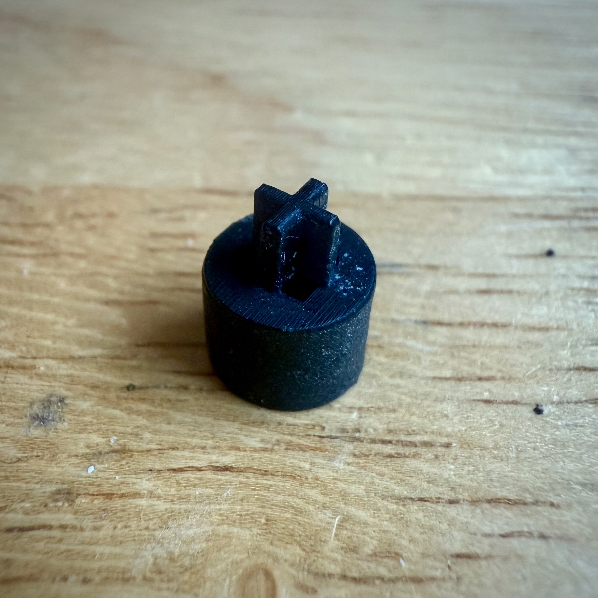
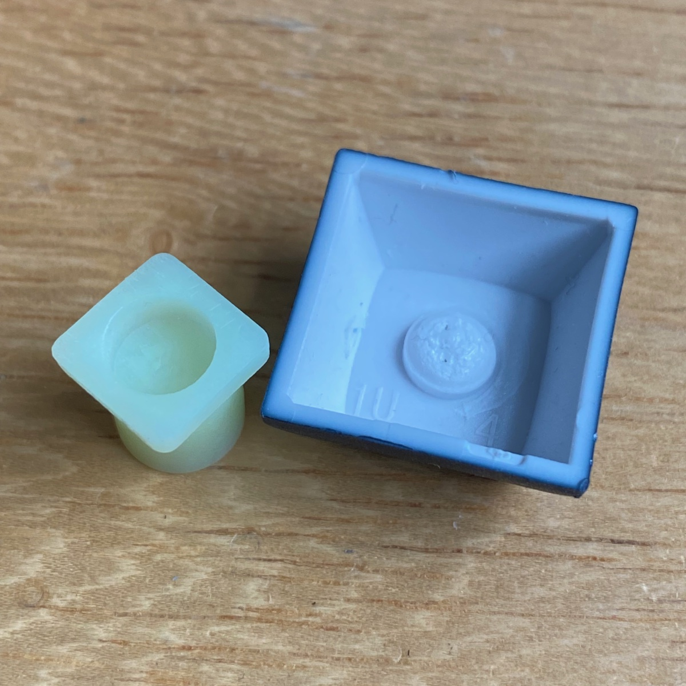

# Nav. Switch to MX Keycap Adaptors

## Nav Switch to MX Stem Adaptor (PCB mount)

This is for [nav. switches][ALPS SKQUCAA010] that are mounted on the keyboard PCB. The
top of the adaptor’s MX stem should line up with the stem tops of the MX switches. The
length of the adaptor combined with the inherent wobbliness of 5-way switches may make
this combination feel a little unstable.

The original model can be found on [Tinkercad][mx2navPCB]

## Nav Switch to MX Stem Adaptor (plate mount)

This is for nav. switches that are mounted using switches mounted level with the plate
(e.g., using a [Nav Switch to MX Adapter][nav2mx]). However, the adapted keycaps will
be higher than those of surrounding MX switches, and because of the thin connection
between the nav. switch sleeve and the MX cross stem, this can be a little fragile.

The original model can be found on [Tinkercad][mx2navPlate]

## Nav Switch to MX Keycap Adaptor (destructive)

This design requires removing the stem[^1] of the keycap and glueing the adaptor in place.
This is the shortest adapter available, and, depending on the mounting setup, can allow
the adapted keycap to be level with others.

I used a Dremel to grind the keycap stem to a nub — it doesn’t need to be completely flat
as the adaptor has space, and a nub provides more contact area for the glue.

The original model can be found on [Tinkercad][mx2navDest]

[^1]: **I.e., irreversibly damaging the keycap!**

[ALPS SKQUCAA010]: https://tech.alpsalpine.com/e/products/detail/SKQUCAA010/
[nav2mx]: https://www.thingiverse.com/thing:3958026
[adaptors]: https://github.com/bgkendall/nav-switch-mount/tree/main/Adaptors
[mx2navPCB]: https://www.tinkercad.com/things/bekaGf7odDx-nav-switch-to-mx-stem-adaptor-pcb-mount?sharecode=R3sgx1bJaI9IwZs5TYhDiTSV8UOKPbyqHVSEtGYQLDg
[mx2navPlate]: https://www.tinkercad.com/things/7jTtJ6HvAXj-nav-switch-to-mx-stem-adaptor-plate-mount?sharecode=IhC0T7EwBWF4NyNEA4Dhvkeg3NzzW6T-peJMX2NnrZU
[mx2navDest]: https://www.tinkercad.com/things/3gL4wvWRLj1-nav-switch-to-mx-keycap-adaptor-destructive?sharecode=r8TKDKdgjJ2txvJRraO-QcmJA2kGXZVvP2sOEYxu-jg
