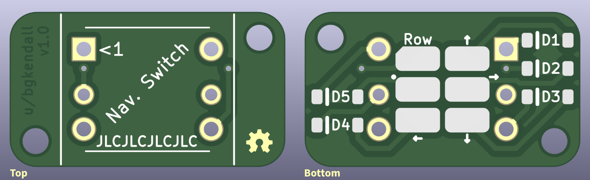
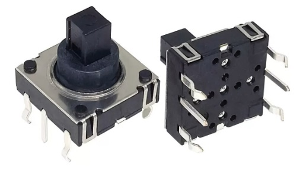

# Nav. Switch Mount

This is a simple PCB for mounting through-hole 5-way navigation switches such as
the [ALPS SKQUCAA010]. It is intended for use in keyboard projects and provides
a way to both secure a nav. switch and easily wire it into a keyboard matrix.

This switch has been discontinued by ALPS, but equivalents can be obtained from
[Adafruit][ada-504] and various vendors on [AliExpress][ali-SKQ][^1].

This repository contains the [KiCad] PCB design files and [Gerber format] files
for PCB production. Zipped Gerber packages are included in the release assets.

[^1]: If no results are shown, try refreshing the page.

## Additional Components Required

 * 1 × [ALPS SKQUCAA010] (or equivalent) navigation switch
 * 5 × 1N4841 [SOD-123] SMD diodes

 ## Options

The PCB comes in two flavours:

 * **1-sided** — 24.3×13mm — the switch and diodes are all mounted on the top
    of the PCB.
 * **2-sided** — 22.3×12.6mm — the diodes are mounted on the opposite side of
    the PCB to the switch.

## Wiring

The switch and diodes are installed as marked. The PCB is wired into the
[keyboard matrix] via the holes (1-sided) or pads (2-sided) on the underside.
The *Row* hole/pad is the common pin for the switch and should be connected to a
row pin on the MCU. The other holes/pads should be connected to columns, with the
silkscreen near the connection point indicating the direction (see notes below).
For the 2-sided PCB, it is envisaged that the wires will run to the underside of
the main keyboard PCB via the switch’s central hole. For the 1-sided PCB the
holes are specifically designed to align up with the centre and two alignment
pins of an MX switch. The best routing will depend on the exact board being
modified — in some cases it may be desirable to run the wires between the plate
and PCB.

When wiring the 1-sided board it is recommended that masking tape is used to
prevent solder from building up on the upper side of the board (in a similar
manner to when socketing an MCU) and the wires will need to be soldered from the
bottom side (i.e., in the opposite way from how a wire would normally be
soldered).

### Notes

 * The markings on the silkscreen orient the diodes for **Column-to-Row** use.
   For a Row-to-Column matrix the diodes must be installed in the opposite
   direction.
 * The arrows point in the direction that the switch is actually pushed. This
   means that when viewed from the bottom the left and right arrows indicate
   right and left movement respectively.
 * The ‘•’ marking indicates the centre press action[^2].

[^2]: On the nav. switches I have used I have found the centre press to be both
      vague and twitchy and have left it unassigned on most layers.

## Mounting

### M2 Hardware

These PCBs are designed to be secured using M2 hardware. Two ~2.1mm holes will
need to be drilled through the keyboard’s plate (or, potentially, the keyboard’s
PCB, although this would need to be planned with great care!).

The mount points are in the same position relative to the centre of the PCB for
both variants.

### MX Adaptor

Alternatively, these PCBs can be used in conjunction with Kevin Eckert’s [Nav
Switch to MX Adapter][nav2mx]. The switch’s legs should be long enough to reach
past the bottom of the adaptor and through the mounting PCB. The switch’s legs
may need to be straightened for ease of soldering (be careful if doing this —
the fragility of these legs was one of the main prompts to create this board!).

For keyboards with a PCB, the adaptor can **only** with the 1-sided variant and
the mounting board must be thinner than the usual 1.6mm to allow room for the
switch legs to be soldered[^3]. The legs will need to be trimmed back as much as
possible to avoid pressing on the keyboard PCB. There is not enough room between
a plate and a keyboard PCB for the adaptor *and* the 2-sided PCB *and* its
diodes.

Careful consideration should be given to the order of assembly when using the
adaptor.

[^3]: At the time of writing 0.8mm PCBs seem to be available for no additional
      charge.

## Keycaps

Options for keycaps on navigation switches:

 * [Adafruit Black Rubber Joystick Nubbin Cap][ada-4697]
 * Kevin Eckert’s SA profile keycap for navigation switches is available
   alongside their [Nav Switch to MX Adapter][nav2mx]
 * If you don’t mind partially destroying a keycap, I have an [MX keycap to nav.
   switch adaptor][mx2nav] — **this is currently untested**

[ALPS SKQUCAA010]: https://tech.alpsalpine.com/e/products/detail/SKQUCAA010/
[KiCad]: https://www.kicad.org
[Gerber format]: https://en.wikipedia.org/wiki/Gerber_format
[ada-504]: https://www.adafruit.com/product/504
[ada-4697]: https://www.adafruit.com/product/4697
[ali-SKQ]: https://www.aliexpress.com/w/wholesale-SKQUCAA010.html?catId=0&SearchText=SKQUCAA010&spm=a2g0o.productlist.1000002.0
[SOD-123]: https://en.wikipedia.org/wiki/Small_Outline_Diode
[keyboard matrix]: https://www.pcbheaven.com/wikipages/How_Key_Matrices_Works/
[nav2mx]: https://www.thingiverse.com/thing:3958026
[mx2nav]: https://www.tinkercad.com/things/3gL4wvWRLj1?sharecode=r8TKDKdgjJ2txvJRraO-QcmJA2kGXZVvP2sOEYxu-jg
